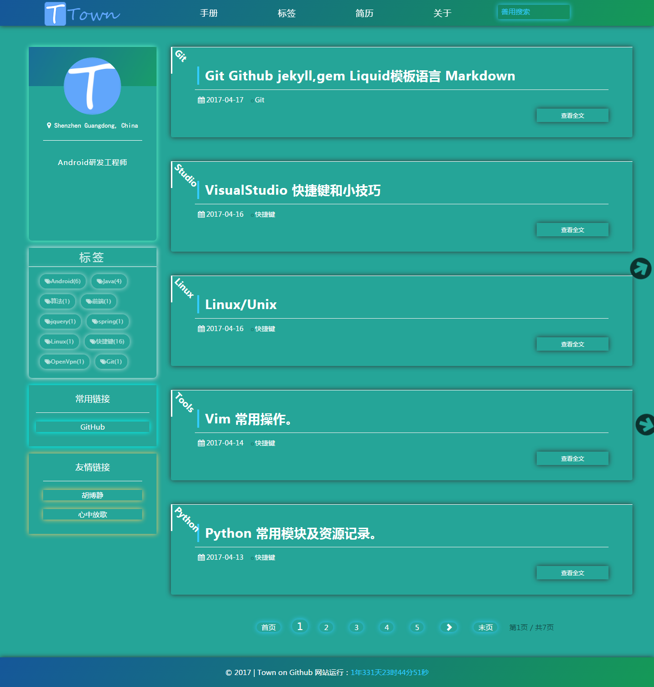
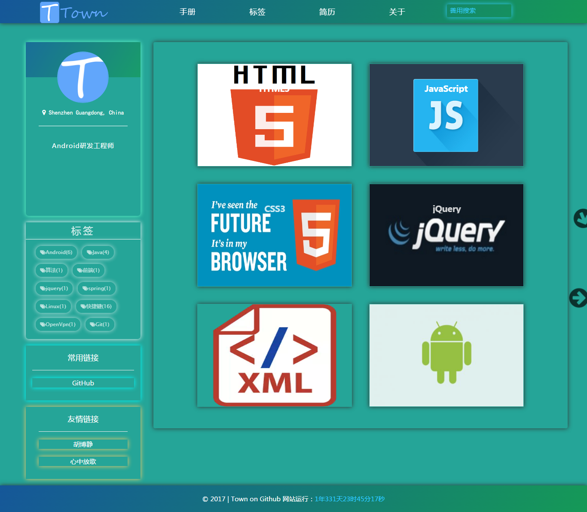
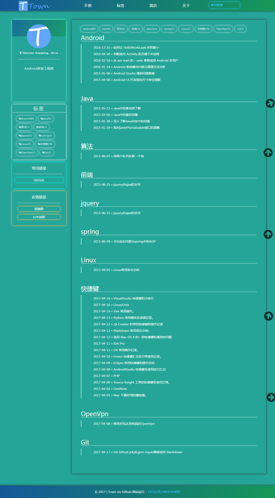
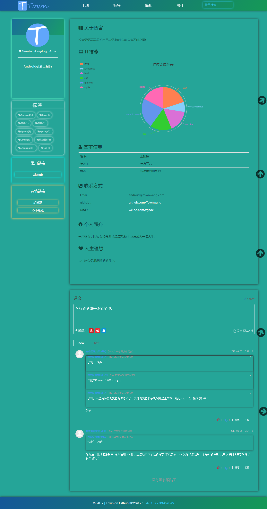

文科中的技术宅：<http://townwang.com>，欢迎 Star 和 Fork。
## 概览

<!-- vim-markdown-toc GFM -->
* [效果图](#效果图)
* [Fork 指南](#fork-指南)
* [贴心提示](#贴心提示)
* [经验与思考](#经验与思考)
* [致谢](#致谢)

<!-- vim-markdown-toc -->
## 效果图

> 首页

> 手册

> 标签

> 关于

> 至于内容什么的就不放了  太长了
## Fork 指南

Fork 本项目之后，还需要做一些事情才能让你的页面「正确」跑起来。

1.正确设置项目名称与分支。

   按照 GitHub Pages 的规定，名称为 `username.github.io` 的项目的 master 分支，或者其它名称的项目的 gh-pages 分支可以自动生成 GitHub Pages 页面。

2.修改域名。

   如果你需要绑定自己的域名，那么修改 CNAME 文件的内容；如果不需要绑定自己的域名，那么删掉 CNAME 文件。

3.修改配置。

   网站的配置基本都集中在 \_config.yml 文件中，将其中与个人信息相关的部分替换成你自己的，比如网站的 title、subtitle、duoshuo 和 Disqus 的用户名等。

   **注意：** 因为 Disqus 处理用户名与域名白名单的策略存在缺陷，请一定将 disqus\_username 修改成你自己的。

4.删除我的文章与图片。

   如下文件夹中都可以全部删除，然后添加你自己的内容。

   * | _posts 文件夹中是我已发布的博客文章。
   * | posts 文件夹中是我已发布博文的配图.

5.修改「关于」页面。

   pages/about.md 文件内容对应网站的「关于」页面，里面的内容多为个人相关，将它们替换成你自己的信息。

## 贴心提示

1. 预览博客效果:[点击进入](http://townwang.com)。

## 经验与思考

* 整体配色以护眼为主

* 未来科技一般的设计,给人一种简洁的感觉

* 结构明确,设计清晰,不繁琐

* 写博客以内容为主,模板其实只为了好看,装装逼.

* 尽量图文结合,易于理解

* 没事看看大牛怎么写博客,怎么组织语言.结构.

## 致谢

欢迎各位大牛加以评论!fork的朋友哪里不知道怎么改的留言.

